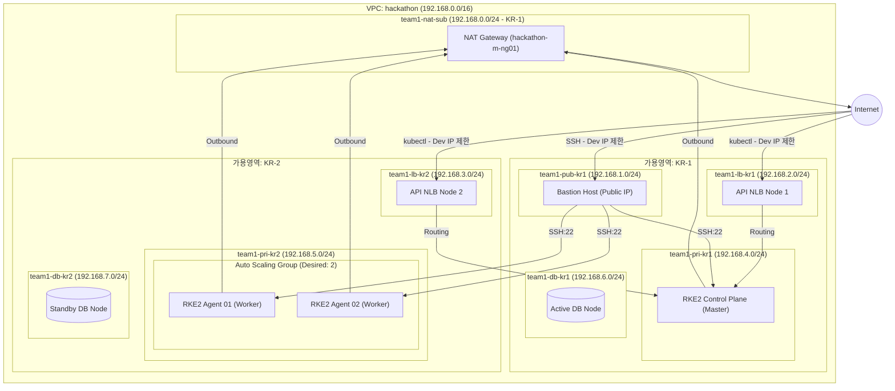

# kosops (koscom-team01) 🚀
> **KOSCOM 신입사원 교육 미니 프로젝트 - GitOps & RKE2 기반 Naver Cloud 인프라 자동 배포 운영 시스템**

`kosops`는 Naver Cloud(금융 클라우드) 환경에서 고도의 보안성과 안정성을 갖춘 쿠버네티스(RKE2) 클러스터를 직접 구성하고, GitOps 원칙에 기반하여 인프라와 애플리케이션의 배포 및 운영을 자동화하는 DevOps 프로젝트입니다.

실제 엔터프라이즈 금융 서비스를 운영한다는 관점에서 **보안성(Security), 고가용성(Multi-AZ HA), 비용 최적화(Cost-efficiency), 원클릭 자동화(One-click Automation)**를 달성하기 위해 2개 가용영역(KR-1, KR-2) 이중화 구조 서브넷을 구성하고, 1 Control Plane, 2 Data Plane(ASG) 아키텍처를 구현하였습니다.

---

## 📌 목차
1. [최종 클라우드 아키텍처 (Multi-AZ)](#1-최종-클라우드-아키텍처-multi-az)
2. [핵심 기술 분석 및 보안 설계](#2-핵심-기술-분석-및-보안-설계)
3. [프로젝트 디렉토리 구조](#3-프로젝트-디렉토리-구조)
4. [배포 및 운영 가이드](#4-배포-및-운영-가이드)

---

## 1. 최종 클라우드 아키텍처 (Multi-AZ)

본 프로젝트는 2개의 가용 영역(Zone KR-1, Zone KR-2)에 걸쳐 네트워크 대역을 분할(VPC 0부터 할당)하여 실제 프라이빗/퍼블릭 및 데이터베이스 대역까지 고가용 구조를 제공합니다.

### 🏢 논리적 네트워크 구성도


### 📋 리소스 매핑 테이블

| 구분 | 리소스명 / 대역 | 가용 영역 (Zone) | 용도 및 보안 정책 |
| :--- | :--- | :--- | :--- |
| **VPC** | `hackathon` (192.168.0.0/16) | 공통 | 전체 사설 네트워크 및 격리 영역 |
| **NAT GW Subnet** | `team1-nat-sub` (192.168.0.0/24) | `KR-1` | NAT Gateway 전용 서브넷 (PUBLIC) |
| **Public Subnet 1** | `team1-pub-kr1` (192.168.1.0/24) | `KR-1` | Bastion Host가 위치하는 일반 퍼블릭 대역 |
| **LB Subnet 1** | `team1-lb-kr1` (192.168.2.0/24) | `KR-1` | K8s API 및 Ingress 처리를 위한 로드밸런서용 퍼블릭 대역 |
| **LB Subnet 2** | `team1-lb-kr2` (192.168.3.0/24) | `KR-2` | 이중화/고가용성 로드밸런서 배치용 퍼블릭 대역 |
| **Private Subnet 1** | `team1-pri-kr1` (192.168.4.0/24) | `KR-1` | **RKE2 Control Plane(CP) Node** 배치용 사설망 |
| **Private Subnet 2** | `team1-pri-kr2` (192.168.5.0/24) | `KR-2` | **RKE2 Data Plane(DP) 노드군 (ASG)** 배치용 사설망 |
| **DB Subnet 1** | `team1-db-kr1` (192.168.6.0/24) | `KR-1` | 데이터베이스용 사설 대역 1 |
| **DB Subnet 2** | `team1-db-kr2` (192.168.7.0/24) | `KR-2` | 데이터베이스용 사설 대역 2 (이중화) |

---

## 2. 핵심 기술 분석 및 보안 설계

### 🔐 Terraform 금융 클라우드 & SSL VPN 연동 분석
KOSCOM 금융 클라우드 통신을 위해 테라폼에 다음 설정을 적용했습니다.
* **Provider 설정**: NCP 금융 클라우드를 타겟팅하기 위해 `site` 변수를 `"fin"`으로 설정하여 금융 전용 API Gateway를 호출하게 구성했습니다.
* **보안 그룹(ACG) 설계**:
  - **Bastion ACG**: 인바운드 SSH(22)를 개발자 PC 공인 IP(`admin_ip`)로만 제한.
  - **Control Plane ACG**: SSH(22)는 Bastion ACG 소스만 허용. RKE2 API(6443) 및 노드 등록(9345)은 VPC 대역(`192.168.0.0/16`) 및 개발자 IP로만 한정. 
  - **Data Plane ACG**: SSH(22)는 Bastion ACG 소스만 허용. K8s 내부 CNI overlay 포트(8472 UDP, 10250 TCP 등)는 내부 대역만 상호 허용. Ingress NodePort(30000-32767)는 로드밸런서 서브넷 대역(`192.168.2.0/24`, `192.168.3.0/24`)의 인입만 허용하여 백엔드 격리 확보.

### 📈 RKE2 Auto-Bootstrapping 및 Auto-Scaling
* **Zero-Touch 마스터 배포**: 테라폼 생성 시 무작위 `random_password` 토큰을 동적으로 생성하고, CP 서버의 `user_data`를 통해 `rke2-server`를 구동할 때 해당 토큰을 주입합니다.
* **Data Plane Auto Scaling**: 워커 노드는 Launch Configuration 및 Auto Scaling Group을 통해 구성됩니다. CP가 생성된 뒤 `user_data` 스크립트를 통해 RKE2 Agent가 자동으로 다운로드 및 CP 사설 IP로 자동 Join 처리됩니다. 룰베이스 확장 정책(`scale_out`, `scale_in`)이 준비되어 있습니다.

### 📦 애플리케이션 및 이미지 관리 (ArgoCD & Harbor)
* **ArgoCD**: Helm 및 Ingress 구조를 기반으로 배포하여 지속적인 배포 상태를 보장합니다.
* **Harbor**: K8s에 내장된 `local-path` 스토리지 프로비저너를 사용하여 DB 및 레지스트리 데이터를 볼륨 영속화하며, 내부망 격리를 통해 컨테이너 이미지 공급망 보안을 달성합니다.

---

## 3. 프로젝트 디렉토리 구조

```
kosops/
├── README.md                      # 전체 프로젝트 아키텍처 및 활용 가이드
├── deploy.sh                      # [원클릭 자동 배포] 원클릭 통합 배포 쉘 스크립트
├── team1-kosops-key.pem           # [자동 생성됨] VM SSH 접속용 개인키 파일
├── team1-kubeconfig.yaml          # [자동 생성됨] 외부 클러스터 API 접속용 Kubeconfig
├── terraform/                     # NCP 인프라 코드 (IaC)
│   └── envs/
│       └── koscom-team01/          # team1 환경 설정
│           ├── main.tf            # 인프라 리소스 정의 (VPC, NAT, ACG, VM, ASG, LB)
│           ├── variables.tf       # 입력 변수 정의 (admin_ip 등)
│           ├── outputs.tf         # 출력 변수 정의
│           ├── providers.tf       # Naver Cloud Provider (site = "fin")
│           └── terraform.tfvars   # 인증 키 및 개발자 IP 입력 설정 파일
└── gitops/                        # GitOps 기반 애플리케이션 및 플랫폼 배포
    ├── bootstrap/                 
    │   └── argocd-values.yaml     # ArgoCD Helm 커스텀 설정
    └── infrastructure/            
        └── harbor-values.yaml     # Harbor Private Registry Helm 커스텀 설정
```

---

## 4. 배포 및 운영 가이드

### 🚀 원클릭 통합 배포 절차
1. 프로젝트 루트 디렉토리에서 자동 배포 스크립트를 실행합니다. 
   * **로컬 공인 IP는 스크립트가 인터넷 통신을 통해 자동 감지**하므로 수동 입력이 불필요합니다.
   * **방법 A (인자 입력 방식 - 추천)**:
     ```bash
     ./deploy.sh <NCP_ACCESS_KEY> <NCP_SECRET_KEY>
     ```
   * **방법 B (대화형 인터랙티브 입력 방식)**:
     ```bash
     ./deploy.sh
     # 스크립트 기동 시 키(Access Key 및 Secret Key) 입력을 순서대로 요구합니다. (보안을 위해 Secret Key는 터미널에 노출되지 않음)
     ```
3. 스크립트가 실행되면서 **[테라폼 리소스 생성 ➡️ SSH 개인키 파일 로컬 저장 ➡️ RKE2 CP 서비스 기동 대기 ➡️ Kubeconfig 덤프 및 LB Endpoint 패치 ➡️ ArgoCD & Harbor 배포]** 과정이 자동으로 연속 수행됩니다.

### 💻 클러스터 접속 및 관리 방법
배포가 성공적으로 완료되면 루트 디렉토리에 생성된 `team1-kubeconfig.yaml`과 `team1-kosops-key.pem` 파일을 통해 전체 시스템을 제어할 수 있습니다.

* **Kubectl 클러스터 노드 점검**:
  ```bash
  export KUBECONFIG=$(pwd)/team1-kubeconfig.yaml
  kubectl get nodes -o wide
  ```
* **Bastion 점프 호스트를 경유한 RKE2 Control Plane VM 직접 SSH 접속**:
  ```bash
  # Bastion IP 및 CP IP는 deploy.sh의 최종 출력 정보 혹은 terraform output을 확인
  ssh -i team1-kosops-key.pem ncloud@<Bastion_Public_IP>
  
  # ProxyCommand를 통해 로컬에서 한 번에 CP 노드 사설망 접속
  ssh -i team1-kosops-key.pem -o ProxyCommand="ssh -i team1-kosops-key.pem -W %h:%p ncloud@<Bastion_Public_IP>" ncloud@<CP_Private_IP>
  ```
