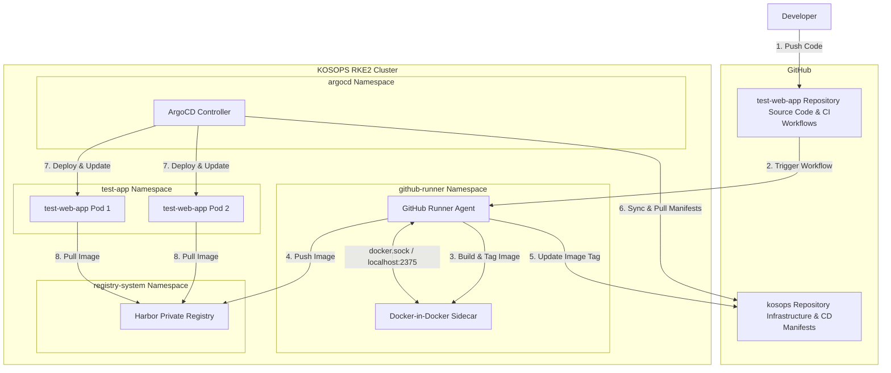

# KOSOPS CI/CD & GitOps 아키텍처 및 워크플로우 가이드

본 문서는 **KOSOPS** 클러스터 내부의 **보안 프라이빗 GitOps (ArgoCD)** 환경과 **쿠버네티스 내부 GitHub Actions Runner**를 연동한 End-to-End CI/CD 아키텍처 및 설정 가이드를 제공합니다.

---

## 1. 아키텍처 개요 (Architecture Overview)

KOSOPS는 **보안성과 유연성**을 극대화하기 위해 **소스 코드 저장소(App Repo)**와 **인프라/배포 설정 저장소(GitOps Repo)**를 철저히 격리하는 **Multi-Repository Pattern**을 따릅니다. 또한 빌드 환경의 외부 노출을 차단하기 위해 **Kubernetes 내부형 Self-Hosted Runner**를 구성하였습니다.



---

## 2. CI/CD 파이프라인 단계별 워크플로우

### 1단계: 개발자 코드 커밋 & 푸시 (CI 트리거)
* 개발자가 애플리케이션 저장소(`test-web-app`)의 `main` 브랜치에 코드를 푸시합니다.
* GitHub은 저장소에 등록된 웹훅을 통해 이벤트를 감지하고 내부 Self-Hosted Runner에게 빌드 작업을 할당합니다.

### 2단계: 사설 러너 기동 및 이미지 빌드 (CI 단계)
* 쿠버네티스 내부에 구동 중인 **GitHub Actions Runner Pod**가 이벤트를 수신합니다.
* 러너는 코드 체크아웃 후, 사이드카로 실행 중인 **DinD (Docker-in-Docker)** 컨테이너 서버를 통해 `Dockerfile` 빌드를 수행합니다.
* 빌드된 도커 이미지는 `harbor.hwangonjang.com/library/test-web:<BUILD_NUMBER>` 형식의 고유 태그를 부여받습니다.

### 3단계: Harbor 사설 저장소 푸시 (CI 단계)
* 빌드가 완료되면 러너는 쿠버네티스 내부망(또는 Ingress 도메인)을 통해 **Harbor Registry**에 인증을 거쳐 이미지를 업로드(Push)합니다.
* 빌드 고유 번호(GitHub Run Number)를 태그로 사용하여 이미지 덮어쓰기 혼선을 완전 차단합니다.

### 4단계: GitOps 배포 사양 업데이트 (GitOps 트리거)
* 이미지 업로드가 성공하면 러너는 사전에 발급된 **Personal Access Token (PAT)**을 활용하여 인프라 설정 레포(`kosops`)를 임시 클론합니다.
* `gitops/apps/test-web-app.yaml` 파일의 `image.tag` 속성값을 방금 빌드한 신규 태그 번호로 정규식 치환합니다.
* 변경사항을 커밋하고 인프라 레포(`kosops`)에 푸시합니다.

### 5단계: ArgoCD 동기화 및 최종 배포 (CD 단계)
* **ArgoCD**는 `kosops` 레포지토리의 변경을 실시간으로 감지합니다.
* 새로 갱신된 태그 선언을 기반으로 `generic-app` 헬름 차트를 렌더링하고, 현재 클러스터의 상태가 변경(OutOfSync)되었음을 확인합니다.
* ArgoCD의 선언 자동 치유 정책(Automated Sync & SelfHeal)에 따라, 신규 이미지를 Harbor로부터 다운로드하여 롤링 업데이트 배포를 완료합니다.

---

## 3. 사용자 매뉴얼 및 직접 설정해야 할 작업

보안 정책상 비밀 토큰이나 개인 권한 증명서는 코드에 직접 삽입하지 않으며, 아래 가이드에 따라 사용자가 수동으로 1회 설정해주어야 합니다.

### 작업 ①: GitHub Actions Runner 토큰 발급 및 주입
1. 깃허브 레포지토리 `test-web-app` (또는 조직)의 `Settings` -> `Actions` -> `Runners`로 이동합니다.
2. `New self-hosted runner` 버튼 클릭 후 `Linux` 탭의 설치 스크립트 본문 중 **`--token` 뒤의 토큰값**을 복사합니다.
3. 터미널을 열고 아래 명령어를 실행하여 쿠버네티스 보안 Secret에 토큰을 심어줍니다.
   ```bash
   kubectl create namespace github-runner --dry-run=client -o yaml | kubectl apply -f -
   kubectl create secret generic github-runner-secret \
     -n github-runner \
     --from-literal=runner-token="<복사한_토큰값>" \
     --dry-run=client -o yaml | kubectl apply -f -
   ```

### 작업 ②: GitHub Actions 전용 PAT 발급 및 Secret 등록
1. GitHub 우측 상단 프로필 클릭 -> `Settings` -> `Developer settings` -> `Personal access tokens` -> `Tokens (classic)`으로 이동합니다.
2. `Generate new token (classic)`을 클릭합니다.
3. 권한(`Scopes`) 설정에서 **`repo`** (Private 레포 쓰기 권한)를 반드시 체크하고 토큰을 생성 및 복사합니다.
4. 애플리케이션 소스 레포지토리(`test-web-app`)의 `Settings` -> `Secrets and variables` -> `Actions` 메뉴로 이동합니다.
5. **`New repository secret`**을 누르고 아래와 같이 비밀 변수를 생성합니다.
   * **Name**: `KOSOPS_PAT`
   * **Value**: 방금 발급한 GitHub PAT 토큰 문자열 붙여넣기

---

## 4. 향후 신규 애플리케이션 추가 시 확장 방법 (Scale-Out)

KOSOPS에 새로운 마이크로서비스(예: `payment-service`, `user-service`)를 추가할 때는 헬름 차트를 새로 만들 필요 없이, 기존에 구축된 **`generic-app`** 차트를 재사용하여 3분 만에 GitOps 파이프라인을 확장할 수 있습니다.

1. **신규 앱 소스 레포 생성**:
   * 소스 레포 내부에 `Dockerfile` 및 위에 설명된 `.github/workflows/ci.yml` 복사 배치 (이미지 이름 및 경로만 수정).
2. **ArgoCD App 선언 추가**:
   * `kosops` 레포의 `gitops/apps/` 하위에 신규 야물 파일 생성 (예: `gitops/apps/payment-service.yaml`)
   * 아래와 같이 공용 차트 경로(`gitops/charts/generic-app`)를 바라보고, `values` 블록에 신규 앱 전용 도메인 및 사양을 기재하여 커밋합니다.
     ```yaml
     apiVersion: argoproj.io/v1alpha1
     kind: Application
     metadata:
       name: payment-service
       namespace: argocd
     spec:
       project: default
       source:
         repoURL: 'https://github.com/koscom-team01/kosops.git'
         targetRevision: HEAD
         path: gitops/charts/generic-app
         helm:
           values: |
             replicaCount: 3
             image:
               repository: harbor.hwangonjang.com/library/payment-service
               tag: latest
             ingress:
               hosts:
                 - host: payment.hwangonjang.com
                   paths:
                     - path: /
                       pathType: Prefix
       destination:
         server: 'https://kubernetes.default.svc'
         namespace: production
     ```
3. **결과**: `kosops` 레포에 파일이 추가되자마자 ArgoCD 부모 앱(`root-app`)이 감지하여 신규 서비스를 클러스터에 완전 자동 프로비저닝합니다.
