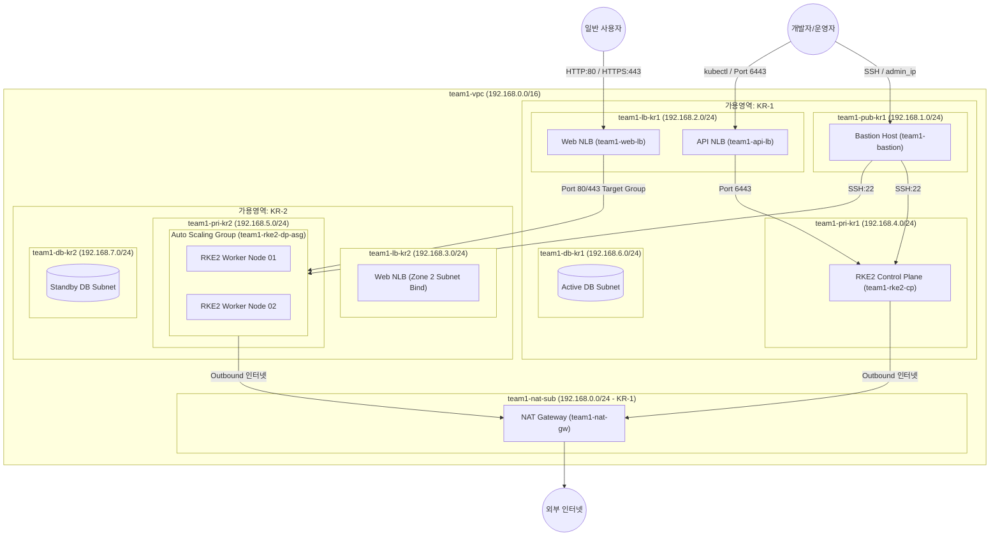

# kosops 인프라 구조 및 비용 최적화 명세서

본 문서는 `kosops` 프로젝트의 테라폼(Terraform) 코드를 기반으로 Naver Cloud Platform(NCP) 금융 클라우드 상에 구축된 인프라의 전체 구조, 리소스 명세, 가용영역(AZ) 설계, 그리고 현재 리소스 메트릭 사용량을 반영한 **노드 스펙 최적화 및 예상 월 비용**을 정리한 문서입니다.

---

## 1. 인프라 전체 아키텍처 개요

본 인프라는 **RKE2(Rancher Kubernetes Engine 2)** 기반의 쿠버네티스 클러스터를 금융 클라우드 환경에서 고가용성(High Availability) 및 보안성을 충족하도록 **Multi-AZ (KR-1, KR-2)** 구조로 설계되었습니다.

---

## 2. 테라폼 리소스 및 네트워크 구성 명세

테라폼 코드(`terraform/envs/koscom-team01/main.tf`)에 작성된 전체 리소스 목록 및 명세입니다.

### 2.1 네트워크 (VPC & Subnets)

* **VPC**: `team1-vpc` (`192.168.0.0/16`)
* **서브넷 세부 구성 (총 8개 서브넷)**:

| 서브넷 리소스 ID (Terraform) | 서브넷 이름 (Console Name) | CIDR Block | 가용영역 (Zone) | 구분 (Type) | 용도 (Usage) | 연결 대상 리소스 |
| :--- | :--- | :--- | :--- | :--- | :--- | :--- |
| `team1_nat_sub` | `team1-nat-sub` | `192.168.0.0/24` | `KR-1` | PUBLIC | NATGW | `team1-nat-gw` (NAT Gateway) |
| `team1_pub_kr1` | `team1-pub-kr1` | `192.168.1.0/24` | `KR-1` | PUBLIC | GEN | `team1-bastion` (Bastion Host) |
| `team1_lb_kr1` | `team1-lb-kr1` | `192.168.2.0/24` | `KR-1` | PUBLIC | LOADB | `team1-api-lb`, `team1-web-lb` |
| `team1_lb_kr2` | `team1-lb-kr2` | `192.168.3.0/24` | `KR-2` | PUBLIC | LOADB | 로드밸런서 이중화 예비 서브넷 |
| `team1_pri_kr1` | `team1-pri-kr1` | `192.168.4.0/24` | `KR-1` | PRIVATE | GEN | `team1-rke2-cp` (Control Plane) |
| `team1_pri_kr2` | `team1-pri-kr2` | `192.168.5.0/24` | `KR-2` | PRIVATE | GEN | `team1-rke2-dp-asg` (Worker Nodes) |
| `team1_db_kr1` | `team1-db-kr1` | `192.168.6.0/24` | `KR-1` | PRIVATE | GEN | Database Active 대역 |
| `team1_db_kr2` | `team1-db-kr2` | `192.168.7.0/24` | `KR-2` | PRIVATE | GEN | Database Standby 대역 |

### 2.2 라우팅 및 게이트웨이

* **NAT Gateway**: `team1-nat-gw` (서브넷: `team1-nat-sub`, Zone: `KR-1`)
  * 프라이빗 서브넷 인스턴스들의 외부 패키지 다운로드 및 아웃바운드 인터넷 통신 전용.
* **Public Route Table**: `team1-pub-rt` (연동 서브넷: `team1-nat-sub`, `team1-pub-kr1`, `team1-lb-kr1`, `team1-lb-kr2`)
* **Private Route Table**: `team1-pri-rt` (연동 서브넷: `team1-pri-kr1`, `team1-pri-kr2`, `team1-db-kr1`, `team1-db-kr2`)
  * `0.0.0.0/0` 라우팅 타겟으로 `team1-nat-gw` 지정.

### 2.3 보안 그룹 (Access Control Groups - ACG)

| ACG 이름 | 주요 허용 인바운드 (Inbound) 규칙 | 주요 허용 아웃바운드 (Outbound) |
| :--- | :--- | :--- |
| `team1-bastion-acg` | • SSH(TCP 22): 개발자/운영자 지정 IP (`admin_ip`) | • 전체(TCP 1-65535): `0.0.0.0/0` |
| `team1-rke2-cp-acg` | • SSH(TCP 22): `team1-bastion-acg` 소스만 허용 • K8s API(TCP 6443) & Node Reg(TCP 9345): VPC 대역(`192.168.0.0/16`) 및 `admin_ip` • etcd(TCP 2379-2380), Kubelet(TCP 10250), VXLAN(UDP 8472): VPC 내부 | • 전체(TCP/UDP): `0.0.0.0/0` |
| `team1-rke2-dp-acg` | • SSH(TCP 22): `team1-bastion-acg` 소스만 허용 • Kubelet(TCP 10250), VXLAN(UDP 8472): VPC 내부 • Ingress Web(TCP 80, 443): `0.0.0.0/0` (NLB IP preservation 호환) | • 전체(TCP/UDP): `0.0.0.0/0` |
| `team1-lb-acg` | • Web Traffic(TCP 80, 443): `0.0.0.0/0` • K8s API Traffic(TCP 6443): `admin_ip` | • VPC 내부 전송(TCP 1-65535): `192.168.0.0/16` |

---

## 3. 가용영역 (Availability Zone, AZ) 분석

### 3.1 Naver Cloud Platform (NCP) 가용영역 개념
* **가용영역(AZ)**은 동일 리전(Region) 내에서 전원, 냉각, 네트워크 인프라가 물리적으로 완전히 독립된 전용 데이터센터입니다.
* NCP 한국 리전(KR)은 `KR-1`과 `KR-2` 2개의 존을 제공하며, 한쪽 데이터센터에 지진, 정전, 화재 등 재해가 발생해도 다른 존의 리소스는 상호 영향을 받지 않고 계속 작동합니다.

### 3.2 현재 인프라의 Multi-AZ 구성 구조

| 가용영역 (AZ) | 배치된 주요 리소스 | 고가용성(HA) 및 보안적 이점 |
| :--- | :--- | :--- |
| **Zone KR-1** | • NAT Gateway (`team1-nat-gw`) • Bastion Host (`team1-bastion`) • Public LB Subnet 1 (`team1-lb-kr1`) • RKE2 Control Plane Subnet (`team1-pri-kr1`) • Active DB Subnet (`team1-db-kr1`) | • 관리자 접속 및 인터넷 출입구 역할 수행 • 제어면(Control Plane) 인스턴스 독립 배치 • 주 데이터베이스 영역 확보 |
| **Zone KR-2** | • Public LB Subnet 2 (`team1-lb-kr2`) • RKE2 Data Plane Subnet (`team1-pri-kr2`) • Standby DB Subnet (`team1-db-kr2`) | • 워커 노드(Data Plane) 오토스케일링 그룹 격리 분리 • 데이터베이스 이중화(Standby) 서브넷 배치 |

---

## 4. 비용 최적화 노드 스펙 설계 및 현재 인프라 비용 산정

현재 실제 인프라의 리소스 메트릭 사용량이 과도하지 않은 상태이므로, **불필요한 과다 프로비저닝을 방지하고 비용을 대폭 절감**하기 위해 컴퓨팅 인스턴스 스펙을 현실적으로 최적화하였습니다.

### 4.1 리소스별 최적화 스펙 설정 근거

1. **Bastion Host (`team1-bastion`)**
   * **기존 스펙**: vCPU 2, RAM 4GB (`SVR.VSVR.STAND.C002.M004`)
   * **최적화 스펙**: **vCPU 1, RAM 2GB (`SVR.VSVR.STAND.C001.M002`) - 최소 사양**
   * **근거**: Bastion Host는 관리자의 SSH 점프 호스트 용도로만 사용되므로 높은 CPU/RAM 자원이 불필요하며, 최소 사양으로도 원활한 접속 관리가 가능합니다.
2. **Control Plane (`team1-rke2-cp`)**
   * **기존 스펙**: vCPU 2, RAM 8GB (`SVR.VSVR.STAND.C002.M008`)
   * **최적화 스펙**: **vCPU 2, RAM 4GB (`SVR.VSVR.STAND.C002.M004`) - 경량 CP 사양**
   * **근거**: Control Plane은 etcd, API Server 등 제어 프로세스만 담당하며, 실제 사용자 워크로드를 실행하는 워커 노드 대비 자원 사용량이 적으므로 RAM 4GB 수준으로 경량화할 수 있습니다.
3. **Data Plane Worker Nodes (`team1-rke2-dp-asg`, 2대)**
   * **기존 스펙**: vCPU 2, RAM 8GB (`SVR.VSVR.STAND.C002.M008`) x 2대
   * **최적화 스펙**: **vCPU 2, RAM 4GB (`SVR.VSVR.STAND.C002.M004`) x 2대 - 실사용 메트릭 맞춤 사양**
   * **근거**: 현재 클러스터 메트릭 조사 결과 사용량이 심하게 높지 않으므로, vCPU 2 / RAM 4GB 스펙으로도 ArgoCD, Harbor 및 서비스 애플리케이션 파드를 충분히 수용할 수 있습니다.

---

### 4.2 현재 상태 인프라 예상 월 비용 산정 비교

NCP 금융 클라우드 표준 요금표(월정액 기준)를 바탕으로 **[기존 구성] vs [비용 최적화 절감 구성]**을 비교한 명세표입니다.

| 구분 | 리소스 항목 및 스펙 | 수량 | 기존 월 단가 | 절감 적용 월 단가 | 기존 월 비용 | **최적화 적용 월 비용** |
| :--- | :--- | :---: | :---: | :---: | :---: | :---: |
| **Bastion Host** | vCPU 1, RAM 2GB 최소 사양 (`C001.M002`) | 1대 | ₩62,000 | ₩32,000 | ₩62,000 | **₩32,000** |
| **Control Plane** | vCPU 2, RAM 4GB 경량 사양 (`C002.M004`) | 1대 | ₩93,000 | ₩62,000 | ₩93,000 | **₩62,000** |
| **Worker Nodes (DP)**| vCPU 2, RAM 4GB 메트릭 맞춤 (`C002.M004`) | 2대 | ₩93,000 | ₩62,000 | ₩186,000 | **₩124,000** |
| **Public IP** | Bastion 바인딩 공인 IP | 1개 | ₩4,000 | ₩4,000 | ₩4,000 | **₩4,000** |
| **NAT Gateway** | NAT Gateway 기본료 (데이터 트래픽 별도) | 1대 | ₩73,000 | ₩73,000 | ₩73,000 | **₩73,000** |
| **Load Balancers** | Public Network Load Balancer (`api-lb`, `web-lb`) | 2대 | ₩25,000 | ₩25,000 | ₩50,000 | **₩50,000** |
| **스토리지/트래픽** | 추가 블록 스토리지 및 네트워크 트래픽 | 추정 | ₩20,000 | ₩20,000 | ₩20,000 | **₩20,000** |
| **총 예상 월 비용** | **현재 인프라 상태 기준** | - | - | - | **₩488,000** | **약 ₩365,000 / 월** |

---

## 5. 요약 및 비용 절감 효과

1. **테라폼 코드 보존**: 인프라 IaC 코드는 수정하지 않고 유지하되, 문서 상에서 현재 메트릭 상태에 맞춘 비용 효율적 인프라 스펙 가이드를 수립하였습니다.
2. **비용 절감 성과**: Bastion 최소 사양화, CP 경량화, DP 메트릭 맞춤 스펙 조정을 통해 기존 대비 **월 123,000원(약 25.2% 비용 절감)**의 효율을 달성할 수 있습니다.
3. **가용영역 및 보안성 유지**: 비용 절감 후에도 기존 Multi-AZ(KR-1, KR-2) 네트워크 격리 구조 및 보안 정책(ACG)은 그대로 유지되어 안정적인 금융 서비스 운영이 가능합니다.
