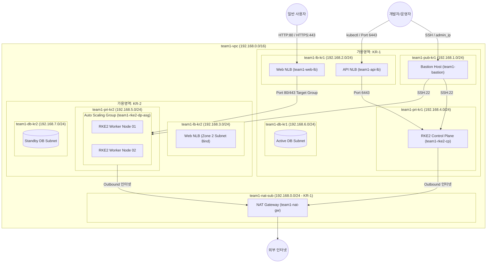

# kosops 인프라 구조 및 리소스 명세서

본 문서는 `kosops` 프로젝트의 테라폼(Terraform) 코드를 기반으로 Naver Cloud Platform(NCP) 금융 클라우드 상에 구축된 인프라의 전체 구조, 리소스 명세, 가용영역(AZ) 설계, 예상 월 비용 및 실제 운영 환경에서의 워커 노드 예측치를 정리한 문서입니다.

---

## 1. 인프라 전체 아키텍처 개요

본 인프라는 **RKE2(Rancher Kubernetes Engine 2)** 기반의 쿠버네티스 클러스터를 금융 클라우드 환경에서 고가용성(High Availability) 및 보안성을 충족하도록 **Multi-AZ (KR-1, KR-2)** 구조로 설계되었습니다.

---

## 2. 테라폼 리소스 및 네트워크 구성 명세

테라폼 코드(`terraform/envs/koscom-team01/main.tf`)에 작성된 전체 리소스 목록 및 명세입니다.

### 2.1 네트워크 (VPC & Subnets)

* **VPC**: `team1-vpc` (`192.168.0.0/16`)
* **서브넷 세부 구성 (총 8개 서브넷)**:

| 서브넷 리소스 ID (Terraform) | 서브넷 이름 (Console Name) | CIDR Block | 가용영역 (Zone) | 구분 (Type) | 용도 (Usage) | 연결 대상 리소스 |
| :--- | :--- | :--- | :--- | :--- | :--- | :--- |
| `team1_nat_sub` | `team1-nat-sub` | `192.168.0.0/24` | `KR-1` | PUBLIC | NATGW | `team1-nat-gw` (NAT Gateway) |
| `team1_pub_kr1` | `team1-pub-kr1` | `192.168.1.0/24` | `KR-1` | PUBLIC | GEN | `team1-bastion` (Bastion Host) |
| `team1_lb_kr1` | `team1-lb-kr1` | `192.168.2.0/24` | `KR-1` | PUBLIC | LOADB | `team1-api-lb`, `team1-web-lb` |
| `team1_lb_kr2` | `team1-lb-kr2` | `192.168.3.0/24` | `KR-2` | PUBLIC | LOADB | 로드밸런서 이중화 예비 서브넷 |
| `team1_pri_kr1` | `team1-pri-kr1` | `192.168.4.0/24` | `KR-1` | PRIVATE | GEN | `team1-rke2-cp` (Control Plane) |
| `team1_pri_kr2` | `team1-pri-kr2` | `192.168.5.0/24` | `KR-2` | PRIVATE | GEN | `team1-rke2-dp-asg` (Worker Nodes) |
| `team1_db_kr1` | `team1-db-kr1` | `192.168.6.0/24` | `KR-1` | PRIVATE | GEN | Database Active 대역 |
| `team1_db_kr2` | `team1-db-kr2` | `192.168.7.0/24` | `KR-2` | PRIVATE | GEN | Database Standby 대역 |

### 2.2 라우팅 및 게이트웨이

* **NAT Gateway**: `team1-nat-gw` (서브넷: `team1-nat-sub`, Zone: `KR-1`)
  * 프라이빗 서브넷 인스턴스들의 외부 패키지 다운로드 및 아웃바운드 인터넷 통신 전용.
* **Public Route Table**: `team1-pub-rt` (연동 서브넷: `team1-nat-sub`, `team1-pub-kr1`, `team1-lb-kr1`, `team1-lb-kr2`)
* **Private Route Table**: `team1-pri-rt` (연동 서브넷: `team1-pri-kr1`, `team1-pri-kr2`, `team1-db-kr1`, `team1-db-kr2`)
  * `0.0.0.0/0` 라우팅 타겟으로 `team1-nat-gw` 지정.

### 2.3 보안 그룹 (Access Control Groups - ACG)

| ACG 이름 | 주요 허용 인바운드 (Inbound) 규칙 | 주요 허용 아웃바운드 (Outbound) |
| :--- | :--- | :--- |
| `team1-bastion-acg` | • SSH(TCP 22): 개발자/운영자 지정 IP (`admin_ip`) | • 전체(TCP 1-65535): `0.0.0.0/0` |
| `team1-rke2-cp-acg` | • SSH(TCP 22): `team1-bastion-acg` 소스만 허용 • K8s API(TCP 6443) & Node Reg(TCP 9345): VPC 대역(`192.168.0.0/16`) 및 `admin_ip` • etcd(TCP 2379-2380), Kubelet(TCP 10250), VXLAN(UDP 8472): VPC 내부 | • 전체(TCP/UDP): `0.0.0.0/0` |
| `team1-rke2-dp-acg` | • SSH(TCP 22): `team1-bastion-acg` 소스만 허용 • Kubelet(TCP 10250), VXLAN(UDP 8472): VPC 내부 • Ingress Web(TCP 80, 443): `0.0.0.0/0` (NLB IP preservation 호환) | • 전체(TCP/UDP): `0.0.0.0/0` |
| `team1-lb-acg` | • Web Traffic(TCP 80, 443): `0.0.0.0/0` • K8s API Traffic(TCP 6443): `admin_ip` | • VPC 내부 전송(TCP 1-65535): `192.168.0.0/16` |

### 2.4 컴퓨팅 인스턴스 & Auto Scaling Group (ASG)

1. **Bastion Host (`team1-bastion`)**
   * OS: Rocky Linux 8.10
   * Server Spec: `SVR.VSVR.STAND.C002.M004.NET.SSD.B050.G002` (vCPU 2, RAM 4GB, Storage 50GB)
   * NIC: `team1-bastion-nic` (`192.168.1.0/24` 서브넷)
   * Public IP: `ncloud_public_ip.bastion_ip` 부착
2. **RKE2 Control Plane (`team1-rke2-cp`)**
   * OS: Rocky Linux 8.10
   * Server Spec: `SVR.VSVR.STAND.C002.M008.NET.SSD.B050.G002` (vCPU 2, RAM 8GB, Storage 50GB)
   * NIC: `team1-rke2-cp-nic` (`192.168.4.11` 고정 사설 IP)
   * Init Script: `team1-rke2-cp-init-*` (RKE2 Server 부트스트래핑 & Harbor private registry 미러 설정)
3. **RKE2 Data Plane Auto Scaling Group (`team1-rke2-dp-asg`)**
   * Launch Configuration: `team1-rke2-dp-lc-*`
   * Server Spec: `SVR.VSVR.STAND.C002.M008.NET.SSD.B050.G002` (vCPU 2, RAM 8GB, Storage 50GB)
   * Subnet: `team1-pri-kr2` (Zone KR-2)
   * 용량 설정: Min=2, Max=4, Desired=2 (기본 워커 노드 2대 기동)
   * Scaling Policy: `team1-scale-out-policy` (+1 변경), `team1-scale-in-policy` (-1 변경)

### 2.5 로드밸런서 (Load Balancer & Target Groups)

1. **RKE2 API Server Load Balancer (`team1-api-lb`)**
   * Type: Public Network Load Balancer (NLB)
   * Subnet: `team1-lb-kr1`
   * Target Group: `team1-api-tg` (TCP 6443, 헬스체크: TCP 6443) -> `team1-rke2-cp` 연결
   * Listener: TCP 6443
2. **Web Service Load Balancer (`team1-web-lb`)**
   * Type: Public Network Load Balancer (NLB)
   * Subnet: `team1-lb-kr1`
   * Target Groups:
     * `team1-web-http-tg` (TCP 80, 헬스체크: TCP 80) -> `team1-rke2-dp-asg` 자동 연결
     * `team1-web-https-tg` (TCP 443, 헬스체크: TCP 443) -> `team1-rke2-dp-asg` 자동 연결
   * Listeners: TCP 80, TCP 443

---

## 3. 가용영역 (Availability Zone, AZ) 분석 및 HA 설계

### 3.1 Naver Cloud Platform (NCP) 가용영역 개념
* **가용영역(AZ)**은 동일 리전(Region) 내에서 전원, 냉각, 네트워크 인프라가 물리적으로 완전히 독립된 전용 데이터센터입니다.
* NCP 한국 리전(KR)은 `KR-1`과 `KR-2` 2개의 존을 제공하며, 한쪽 데이터센터에 지진, 정전, 화재 등 재해가 발생해도 다른 존의 리소스는 상호 영향을 받지 않고 계속 작동합니다.

### 3.2 현재 테라폼 아키텍처의 Multi-AZ 구성 구조

| 가용영역 (AZ) | 배치된 주요 리소스 | 고가용성(HA) 및 보안적 이점 |
| :--- | :--- | :--- |
| **Zone KR-1** | • NAT Gateway (`team1-nat-gw`) • Bastion Host (`team1-bastion`) • Public LB Subnet 1 (`team1-lb-kr1`) • RKE2 Control Plane Subnet (`team1-pri-kr1`) • Active DB Subnet (`team1-db-kr1`) | • 관리자 접속 및 인터넷 출입구 역할 수행 • 쿠버네티스 제어면(Control Plane) 노드 격리 관리 • 주 데이터베이스 영역 확보 |
| **Zone KR-2** | • Public LB Subnet 2 (`team1-lb-kr2`) • RKE2 Data Plane Subnet (`team1-pri-kr2`) • Standby DB Subnet (`team1-db-kr2`) | • 워커 노드(Data Plane) 오토스케일링 그룹 격리 분리 • 데이터베이스 이중화(Standby / Disaster Recovery) 서브넷 배치 |

### 3.3 운영 환경 확장을 위한 가용영역(AZ) 고가용성 개선 방안
1. **Control Plane Multi-Master (3-Node) 배포**:
   * 현재 1대(`team1-rke2-cp`)인 Control Plane을 3대로 확장하여 KR-1에 2대, KR-2에 1대(또는 3개 존 분산)로 배치하여 RKE2 etcd 클러스터의 Quorum(과반수 합의) 고가용성을 달성합니다.
2. **Data Plane Multi-AZ ASG 분산**:
   * ASG의 서브넷 목록에 `team1-pri-kr1`과 `team1-pri-kr2`를 동시에 지정하여 워커 노드가 두 가용영역에 50:50 비율로 균등하게 자동 생성되도록 개선합니다.

---

## 4. 현재 환경(개발/테스트) 예상 월 비용 산출

NCP 금융 클라우드 표준 요금표(월정액/시간당 정량 요금 환산) 기준 예상 비용입니다.

| 구분 | 리소스 항목 및 스펙 | 수량 | 단가 (월 기준 예상) | 합계 (월 예상 비용) |
| :--- | :--- | :---: | :---: | :---: |
| **Bastion Host** | vCPU 2, RAM 4GB, Disk 50GB (`SVR.VSVR.STAND.C002.M004`) | 1대 | ₩62,000 | ₩62,000 |
| **Control Plane** | vCPU 2, RAM 8GB, Disk 50GB (`SVR.VSVR.STAND.C002.M008`) | 1대 | ₩93,000 | ₩93,000 |
| **Worker Nodes (DP)**| vCPU 2, RAM 8GB, Disk 50GB (`SVR.VSVR.STAND.C002.M008`) | 2대 | ₩93,000 | ₩186,000 |
| **Public IP** | Bastion 바인딩 공인 IP | 1개 | ₩4,000 | ₩4,000 |
| **NAT Gateway** | NAT Gateway 기본료 (데이터 트래픽 별도) | 1대 | ₩73,000 | ₩73,000 |
| **Load Balancers** | Public Network Load Balancer (`api-lb`, `web-lb`) | 2대 | ₩25,000 | ₩50,000 |
| **스토리지/트래픽** | 추가 블록 스토리지 및 기본 네트워크 아웃바운드 트래픽 | 추정 | 약 ₩20,000 | ₩20,000 |
| **총 예상 월 비용** | **현재 테라폼 구성 (Worker 2대 기준)** | - | - | **약 ₩488,000 / 월** |

---

## 5. 실제 운영 환경(Production) 워커 노드 개수 예측 및 예상 비용

### 5.1 운영 환경 워크로드 용량 산정 근거

실제 금융 서비스 운영 환경(`koslink` 서비스)에서는 다음 플랫폼 서비스 및 애플리케이션 서비스가 쿠버네티스 클러스터 상에서 수용되어야 합니다.

1. **플랫폼 및 인프라 파드 (System Workloads)**:
   * **ArgoCD**: GitOps 컨트롤러, Server, Repo Server (~0.5 vCPU, 1.5GB RAM)
   * **Harbor Private Registry**: Core, DB, Redis, Trivy, Jobservice, Registry (~1.5 vCPU, 4GB RAM)
   * **Ingress Controller (Nginx)**: Edge traffic router (~1 vCPU, 2GB RAM)
   * **모니터링/로깅 (Prometheus + Grafana + Loki)**: 메트릭/로그 수집 (~2 vCPU, 6GB RAM)
   * **플랫폼 소계**: 약 **5 vCPU / 13.5GB RAM**
2. **애플리케이션 파드 (Application Workloads)**:
   * `koslink-fe` (React/Nginx): Multi-Replica (3개) (~0.5 vCPU, 1.5GB RAM)
   * `koslink-backend` (Spring Boot API): Multi-Replica (3~5개) (~2 vCPU, 6GB RAM)
   * `koslink-ai` (FastAPI / AI Inference / PyTorch / Vector DB): Multi-Replica (~4 vCPU, 12GB RAM)
   * **애플리케이션 소계**: 약 **6.5 vCPU / 19.5GB RAM**
3. **고가용성 및 스케줄링 여유율 (HA & Safety Buffer)**:
   * 클러스터 최고 부하율 70% 미만 유지 (노드 1대 장애 시 Failover 수용 능력 확보, N+1 롤링 업데이트 기여).
   * 총 필요한 클러스터 자원: **최소 16 vCPU / 48GB RAM 이상**

### 5.2 운영 환경 워커 노드 개수 예측치

운영 환경에서는 노드 스펙을 **vCPU 4, RAM 16GB (`SVR.VSVR.STAND.C004.M016`)** 급으로 상향하는 것을 권장합니다.

* **최소 워커 노드 수 (Minimum)**: **4대** (가용영역별 2대씩 배치, 16 vCPU / 64GB RAM)
* **권장 워커 노드 수 (Recommended Production)**: **6대** (가용영역별 3대씩 배치, 24 vCPU / 96GB RAM)
  * *이유*: 1개 데이터센터(Zone) 장애 시에도 남아있는 가용영역 3대 워커 노드가 전체 서비스 100% 지속 수용 가능.
* **피크 타임 오토스케일링 최대 노드 수 (Maximum ASG)**: **8~10대**

### 5.3 운영 환경 단계별 전체 월 비용 비교 산정

| 서비스 단계 | 마스터 노드 (CP) | 워커 노드 (DP) | 기타 인프라 (NAT/LB/IP 등) | 총 예상 월 비용 |
| :--- | :--- | :--- | :--- | :--- |
| **현재 개발/테스트** | 1대 (v2/m8) : ₩93,000 | 2대 (v2/m8) : ₩186,000 | ₩209,000 | **약 ₩488,000 / 월** |
| **운영 환경 (Small Production)** | 3대 (v2/m8, HA) : ₩279,000 | 4대 (v4/m16) : ₩720,000 | ₩250,000 | **약 ₩1,249,000 / 월** |
| **운영 환경 (Standard Production - 권장)** | 3대 (v2/m8, HA) : ₩279,000 | **6대 (v4/m16) : ₩1,080,000** | ₩280,000 | **약 ₩1,639,000 / 월** |
| **운영 환경 (Large / Peak Traffic)** | 3대 (v4/m16, HA) : ₩540,000 | 8대 (v4/m16) : ₩1,440,000 | ₩350,000 | **약 ₩2,330,000 / 월** |

---

## 6. 요약 및 시사점

1. **보안 및 규제 준수**: 금융 클라우드 환경 요구사항에 맞추어 모든 RKE2 노드가 Private Subnet에 위치하며, Bastion Host 및 로드밸런서를 거쳐서만 통신하도록 ACG 및 라우팅이 원격 격리되어 있습니다.
2. **Multi-AZ 기반의 장애 복구력**: 네트워크 및 서브넷 수준에서 KR-1과 KR-2를 분리하여 단일 데이터센터 장애 시에도 비즈니스 연속성을 보장합니다.
3. **비용 효율적인 운영 전략**: 개발 단계에서는 약 48만원/월 수준으로 최소화하고, 실제 운영 시에는 워커 노드를 6대로 확장하여 약 164만원/월 규모로 고가용성 및 서비스 안정성을 달성할 수 있습니다.
